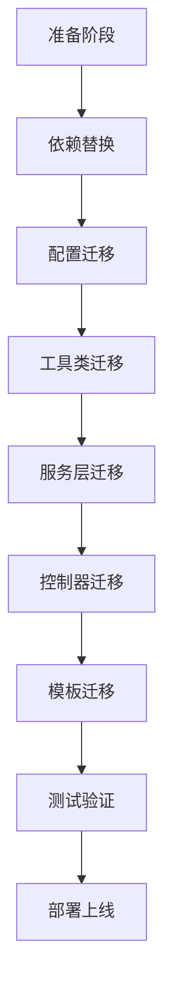

# 🔄 RuoYi 管理系统：Shiro 迁移到 Sa-Token 完整方案

> **项目**: RuoYi 4.8.3  
> **当前认证框架**: Apache Shiro 2.1.0  
> **目标认证框架**: Sa-Token 1.39.0  
> **方案版本**: 1.0  
> **创建日期**: 2026-06-09

---

## 📚 文档导航

本迁移方案包含以下文档，请按顺序阅读：

### 核心文档

1. **[SHIRO_TO_SATOKEN_MIGRATION_PLAN.md](./SHIRO_TO_SATOKEN_MIGRATION_PLAN.md)**
   - 项目概述
   - 当前Shiro使用情况分析
   - Sa-Token功能映射表

2. **[SHIRO_TO_SATOKEN_MIGRATION_PLAN_PART2.md](./SHIRO_TO_SATOKEN_MIGRATION_PLAN_PART2.md)**
   - 阶段一：依赖替换
   - 阶段二：配置类迁移

3. **[SHIRO_TO_SATOKEN_MIGRATION_PLAN_PART3.md](./SHIRO_TO_SATOKEN_MIGRATION_PLAN_PART3.md)**
   - 阶段三：核心工具类迁移
   - 阶段四：业务服务层迁移

4. **[SHIRO_TO_SATOKEN_MIGRATION_PLAN_PART4.md](./SHIRO_TO_SATOKEN_MIGRATION_PLAN_PART4.md)**
   - 阶段五：控制器层迁移
   - 阶段六：权限服务迁移

5. **[SHIRO_TO_SATOKEN_MIGRATION_PLAN_PART5.md](./SHIRO_TO_SATOKEN_MIGRATION_PLAN_PART5.md)**
   - 阶段七：Thymeleaf模板迁移
   - 阶段八：在线用户管理迁移
   - 阶段九：密码服务迁移

6. **[SHIRO_TO_SATOKEN_MIGRATION_PLAN_PART6.md](./SHIRO_TO_SATOKEN_MIGRATION_PLAN_PART6.md)**
   - 阶段十：异常处理迁移
   - 阶段十一：删除旧代码
   - 阶段十二：测试验证
   - 阶段十三：回滚方案

7. **[SHIRO_TO_SATOKEN_MIGRATION_PLAN_PART7.md](./SHIRO_TO_SATOKEN_MIGRATION_PLAN_PART7.md)**
   - 阶段十四：优化建议
   - 工作量评估
   - 重要注意事项
   - 快速参考手册
   - 参考资源

8. **[SHIRO_TO_SATOKEN_MIGRATION_PLAN_FINAL.md](./SHIRO_TO_SATOKEN_MIGRATION_PLAN_FINAL.md)**
   - 迁移执行检查清单
   - 迁移总结
   - 后续建议

---

## 🎯 快速开始

### 迁移前准备

1. **阅读所有文档**（预计2-3小时）
2. **环境准备**：
   ```bash
   # 创建迁移分支
   git checkout -b feature/migrate-to-satoken
   
   # 备份数据库
   mysqldump -u root -p ruoyi > backup_before_migration.sql
   ```

3. **团队沟通**：
   - 召开技术会议讨论方案
   - 确认迁移时间窗口
   - 分配任务责任人

### 迁移步骤概览



### 预计时间

- **总工作量**: 12个工作日
- **建议人员**: 4人（2后端 + 1前端 + 1测试）
- **实际工期**: 2-3周（含测试和优化）

---

## 📊 影响范围

### 代码层面

| 类型 | 数量 | 操作 |
|-----|------|------|
| Maven依赖 | 5个 | 删除Shiro，添加Sa-Token |
| Java类 | 30+个 | 修改注解和API调用 |
| 配置类 | 1个 | 完全重写 |
| 工具类 | 3个 | 修改或新建 |
| Controller | 30+个 | 批量替换注解 |
| HTML模板 | 100+个 | 批量替换权限标签 |
| 配置文件 | 3个 | 修改YAML配置 |

### 功能影响

✅ **保持不变的功能**：
- 用户登录/登出
- 权限控制
- 角色管理
- 在线用户管理
- 会话管理
- 密码加密

⚠️ **需要注意的变化**：
- 在线用户需要重新登录
- Session存储方式改变
- 权限缓存机制不同
- API调用方式改变

---

## 🔧 核心技术对比

### Shiro vs Sa-Token

| 特性 | Apache Shiro | Sa-Token |
|-----|-------------|----------|
| 框架大小 | 较大 | 轻量级 |
| 学习曲线 | 较陡峭 | 平缓 |
| API设计 | 面向对象 | 静态工具类 |
| 文档质量 | 较旧 | 丰富且新 |
| 社区活跃度 | 一般 | 非常活跃 |
| 微服务支持 | 需额外配置 | 原生支持 |
| Redis集成 | 需自己实现 | 开箱即用 |
| JWT支持 | 需插件 | 内置支持 |
| OAuth2 | 需集成 | 内置支持 |
| SSO支持 | 复杂 | 简单 |

---

## 💡 关键API对照

### 登录相关

```java
// ===== Shiro =====
Subject subject = SecurityUtils.getSubject();
UsernamePasswordToken token = new UsernamePasswordToken(username, password);
subject.login(token);

// ===== Sa-Token =====
StpUtil.login(userId);
```

### 获取当前用户

```java
// ===== Shiro =====
SysUser user = (SysUser) SecurityUtils.getSubject().getPrincipal();

// ===== Sa-Token =====
SysUser user = SaTokenUtils.getSysUser();
```

### 权限判断

```java
// ===== Shiro =====
@RequiresPermissions("system:user:list")
public String list() { }

// ===== Sa-Token =====
@SaCheckPermission("system:user:list")
public String list() { }
```

### 登出

```java
// ===== Shiro =====
SecurityUtils.getSubject().logout();

// ===== Sa-Token =====
StpUtil.logout();
```

---

## ⚠️ 重要提示

### 迁移风险

1. **高风险项**：
   - ⚠️ 所有在线用户会被强制下线
   - ⚠️ 记住我Cookie会失效
   - ⚠️ 原有Session数据会丢失

2. **缓解措施**：
   - 选择低峰期（如凌晨）进行迁移
   - 提前3天通知用户
   - 准备快速回滚方案
   - 保持生产数据库备份

### 必测功能清单

- [ ] 用户登录（正常/异常）
- [ ] 权限控制（菜单/按钮/接口）
- [ ] 角色管理
- [ ] 在线用户（查看/踢出）
- [ ] 会话超时
- [ ] 记住我功能
- [ ] 密码重试限制
- [ ] 并发登录控制
- [ ] 用户登出
- [ ] 异常处理

---

## 📖 使用说明

### 对于AI助手

本方案采用**AI友好设计**，特点如下：

1. **模块化文档**：按阶段拆分，便于逐步实施
2. **代码块完整**：所有示例代码可直接使用
3. **检查清单详细**：每个步骤都有明确的验证标准
4. **对照表清晰**：Shiro和Sa-Token API一一对应
5. **自动化脚本**：提供批量替换工具

### 对于开发人员

**建议阅读顺序**：

1. 先快速浏览本README
2. 详细阅读PART1了解现状
3. 按顺序阅读PART2-7执行迁移
4. 使用FINAL中的检查清单验证
5. 参考快速参考手册解决问题

**迁移技巧**：

- 使用IDE的全局搜索替换功能
- 每完成一个阶段立即提交代码
- 编写单元测试覆盖关键功能
- 保持与团队的密切沟通

---

## 🎓 学习资源

### Sa-Token官方资源

- **官方网站**: https://sa-token.cc/
- **完整文档**: https://sa-token.cc/doc.html
- **GitHub**: https://github.com/dromara/sa-token
- **Gitee**: https://gitee.com/dromara/sa-token
- **示例项目**: https://github.com/dromara/sa-token/tree/master/sa-token-demo

### 视频教程

- 哔哩哔哩搜索："Sa-Token教程"
- YouTube搜索："Sa-Token Tutorial"

### 社区支持

- **QQ群**: 见官网
- **微信群**: 见官网
- **Issues**: https://gitee.com/dromara/sa-token/issues

---

## 📞 技术支持

### 遇到问题？

1. **查阅文档**: 先查看本方案对应章节
2. **搜索Issues**: 在Sa-Token的GitHub/Gitee上搜索
3. **官方文档**: 查看Sa-Token官方文档
4. **社区求助**: 在社群中提问
5. **提交Issue**: 描述清楚问题和环境

### 反馈建议

如果您在使用本迁移方案过程中有任何建议或发现问题，欢迎反馈。

---

## 📄 许可证

本迁移方案遵循 MIT License。

- RuoYi: Apache License 2.0
- Apache Shiro: Apache License 2.0  
- Sa-Token: Apache License 2.0

---

## 🙏 致谢

感谢以下项目和开源作者：

- [RuoYi](http://www.ruoyi.vip/) - 若依管理系统
- [Sa-Token](https://sa-token.cc/) - 轻量级Java权限认证框架
- [Apache Shiro](https://shiro.apache.org/) - Java安全框架

---

## 📝 版本历史

- **v1.0** (2026-06-09)
  - 初始版本发布
  - 包含完整迁移方案
  - 覆盖RuoYi 4.8.3版本

---

**祝迁移顺利！** 🚀

如有问题，请参考各部分详细文档或联系技术支持。
